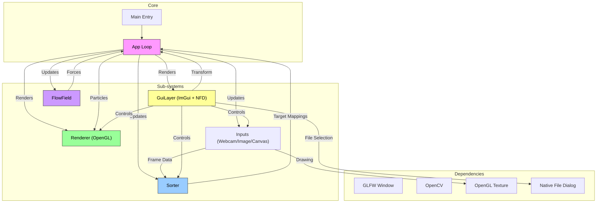

# LumaSort Engine

> **Copyright (c) 2025**  
> This project is licensed under the **CC BY-NC-ND 4.0** license.  
> See the [LICENSE](LICENSE) file for details.

[](https://isocpp.org/)
[](https://www.opengl.org/)
[](https://github.com/ocornut/imgui)
[](https://opencv.org/)
[](https://github.com/btzy/nativefiledialog-extended)
[](https://cmake.org/)
[](https://vcpkg.io/)

---

## Introduction

**LumaSort Engine** is a high-performance C++20 real-time visualizer that rearranges pixels from live video feeds, static images, or real-time drawings into a target image based on global luminance intensity. By combining a "Pixel Sorting" algorithm with Fluid Dynamics (Flow Fields), it creates a mesmerizing, fluid-like transition of pixels finding their new "home" based on brightness.

The engine features a complete GUI control panel with native file dialogs, real-time physics parameter tuning, and an interactive canvas with VIBGYOR color palette for drawing. Users can load source and target images, adjust particle behavior, and watch the transformation unfold with a single button click.

---

## Table of Contents

- [Introduction](#introduction)
- [Features](#features)
- [How It Works](#how-it-works)
- [Architecture](#architecture)
- [Tech Stack](#tech-stack)
- [Directory Structure](#directory-structure)
- [Download & Run](#download--run)
- [Build from Source](#build-from-source)
- [Usage Guide](#usage-guide)
- [Troubleshooting](#troubleshooting)
- [License](#license)

---

## Features

- **Multi-Input Support**: Live Webcam, Static Images, or Interactive Drawing Canvas
- **Native File Dialogs**: OS-native file pickers for loading source and target images
- **Interactive Canvas**: Draw with VIBGYOR color palette, adjustable brush sizes, and eraser tool
- **Transform Control**: Start/Stop transformation with dedicated button - preview content before animating
- **Adaptive Resolution**: Automatically adjusts particle count based on source image resolution
- **Real-time Visualization**: High-performance sorting at 60+ FPS
- **Physics Parameter Tuning**: Adjust particle speed, flow strength, and noise scale in real-time
- **Fluid Dynamics**: Pixels move organically using Flow Fields (Perlin/Simplex Noise)

---

## How It Works

1.  **Input Selection**: Choose between Webcam, Image, or Canvas mode via the GUI dropdown
2.  **Source Loading**: Load images using native file dialogs or draw on the canvas
3.  **Target Loading**: Select a target image that defines the final shape/pattern
4.  **Preview**: View your source content as a stable image before transformation
5.  **Transform**: Click "Start Transform" to begin the particle animation
    - **Luminance Sorting**: Each source pixel is matched to a target pixel of similar brightness
    - **Steering Forces**: Particles feel a pull towards their sorted destination
    - **Flow Field**: Background vector field adds organic turbulence to the motion
6.  **Convergence**: Particles gradually settle into the target shape, recreating the image

---

## Architecture

The engine follows a strict separation of concerns with a complete GUI layer for user interaction.



---

## Tech Stack

| Component | Technology | Reasoning |
| :--- | :--- | :--- |
| **Language** | C++20 | High-performance memory management and modern language features. |
| **Build System** | CMake | Industry standard for cross-platform C++ build configuration. |
| **Package Manager** | vcpkg | Seamless integration of libraries in "Manifest Mode" for reproducible builds. |
| **Computer Vision** | OpenCV 4 | Robust library for webcam feeds and efficient image matrix manipulation. |
| **Rendering** | OpenGL 3.3+ | Hardware acceleration for rendering millions of particles at 60 FPS. |
| **Windowing** | GLFW + GLAD | Lightweight, standard way to create contexts and handle input. |
| **UI** | Dear ImGui | Immediate Mode GUI for real-time parameter tuning and controls. |
| **File Dialogs** | NFD Extended | Cross-platform native file dialogs for OS-integrated file selection. |
| **Math** | GLM | Standard mathematics library for graphics (vectors, matrices, noise). |

---

## Directory Structure

```text
lumasort-engine/
├── vcpkg.json              # Dependency Manifest (OpenCV, ImGui, NFD, etc.)
├── CMakeLists.txt          # Build Configuration
├── src/
│   ├── main.cpp            # Entry Point
│   ├── app.h/cpp           # Application Loop, State, & Transform Logic
│   ├── core/
│   │   ├── sorter.h/cpp    # Luminance-based Pixel Sorting Algorithm
│   │   ├── particle.h      # Particle Entity Structure
│   │   └── flow_field.h/cpp# Fluid Math (Perlin/Simplex Noise)
│   ├── graphics/
│   │   ├── renderer.h/cpp  # OpenGL Particle Rendering
│   │   ├── texture.h/cpp   # Texture Management & OpenCV Upload
│   │   └── canvas.h/cpp    # FBO Drawing Surface with Color Support
│   └── ui/
│       └── gui_layer.h/cpp # ImGui Control Panel & Native File Dialogs
├── assets/
│   ├── shaders/            # GLSL Vertex & Fragment Shaders
│   └── images/             # Sample Images
└── build/                  # (Generated) Build artifacts
```

---

## Download & Run

Pre-built releases are available for **Windows** and **Linux**. No compilation required!

### 📥 Download

Go to the [**Releases Page**](https://github.com/PundarikakshNTripathi/LumaSort-Engine/releases) and download the latest version for your OS.

### 🪟 Windows

1. Download `LumaSort-windows-x64.zip`
2. Extract the ZIP file
3. Double-click `LumaSort.exe` to run

### 🐧 Linux

1. Download `LumaSort-linux-x86_64.tar.gz`
2. Extract and run:
```bash
tar -xzvf LumaSort-linux-x86_64.tar.gz
cd LumaSort-linux
./run.sh
```

> **Note:** The `run.sh` script sets up the library paths automatically. Always use it to launch the application.

---

## Build from Source

If you want to modify the code or build for a different platform, follow these instructions.

### 1. Requirements

**Essential Build Tools:**
- C++ Compiler (GCC 11+ / Clang 14+)
- CMake (3.20+)
- Ninja or Make

**System Libraries (Linux):**
- **X11 / OpenGL**: `libx11-dev`, `libglu1-mesa-dev`
- **GTK3** (for native file dialogs): `libgtk-3-dev`
- **Build Helpers**: `bison`, `flex`, `gperf`, `pkg-config`
- **Python Build Environment**: `python3-venv`

### 2. Installation (One-line)
```bash
sudo apt update && sudo apt install -y build-essential pkg-config cmake ninja-build autoconf autoconf-archive automake libtool bison flex gperf libx11-dev libxext-dev libxrandr-dev libxinerama-dev libxcursor-dev libxi-dev libglu1-mesa-dev libgl1-mesa-dev libgtk-3-dev python3-venv python3-jinja2
```

### 3. Build & Run

1.  **Clone the Repository**
    ```bash
    git clone https://github.com/your-username/LumaSort-Engine.git
    cd LumaSort-Engine
    ```

2.  **Configure (CMake + vcpkg)**
    ```bash
    cmake -B build -S . -DCMAKE_TOOLCHAIN_FILE=/path/to/vcpkg/scripts/buildsystems/vcpkg.cmake
    ```
    *(Note: First build downloads and compiles all dependencies - may take 5-10 minutes)*

3.  **Compile**
    ```bash
    cmake --build build
    ```

4.  **Run**
    ```bash
    ./build/LumaSort
    ```

---

## Usage Guide

### Input Modes

1. **Webcam**: Live camera feed (adapts to webcam resolution, capped at 600px)
2. **Image**: Load any image file - resolution adapts automatically (up to 800px)
3. **Canvas**: Draw with VIBGYOR colors using pen/eraser tools

### Workflow

1. Select input mode from the dropdown
2. Load a **Target Image** using the native file dialog
3. For Image mode: Load a **Source Image**
4. For Canvas mode: Draw your design using the color palette
5. Click **Start Transform** to begin the animation
6. Adjust **Physics Parameters** (Speed, Flow Strength, Noise Scale) in real-time
7. Click **Stop Transform** to reset and try again

### Physics Parameters

| Parameter | Description | Range |
| :--- | :--- | :--- |
| Particle Speed | How fast particles move toward targets | 0.001 - 0.1 |
| Flow Strength | Intensity of turbulent flow field | 0.0001 - 0.01 |
| Noise Scale | Size of flow field patterns | 1.0 - 20.0 |

---

## Troubleshooting

### `vcpkg install failed` with `python3 -m venv failed`
**Fix:** Install the missing python module:
```bash
sudo apt install python3-venv
```

### `Could not find bison` or `GPERF not found`
**Fix:** Install build tool suite:
```bash
sudo apt install bison flex gperf
```

### Native file dialogs not working
**Cause:** GTK3 development libraries are required for native file dialogs on Linux.
**Fix:**
```bash
sudo apt install libgtk-3-dev
```

### `CMake Error: CMAKE_MAKE_PROGRAM is not set`
**Fix:**
```bash
sudo apt install build-essential ninja-build
```

### Low FPS with high-resolution images
**Cause:** Very large images (5000x3000+) generate hundreds of thousands of particles.
**Note:** This is expected behavior - the engine caps at 800px for images to maintain performance.

---

## License

This project is distributed under the **Creative Commons Attribution-NonCommercial-NoDerivatives 4.0 International** license.

**What this means:**

✅ You can view and use this code for learning  
✅ You can share this project with attribution  
❌ You cannot use this commercially  
❌ You cannot create modified versions  

See [LICENSE](LICENSE) for the full legal text.

---
*Built with ❤️ using C++20, OpenGL, Dear ImGui, OpenCV, NFD, and vcpkg.*
